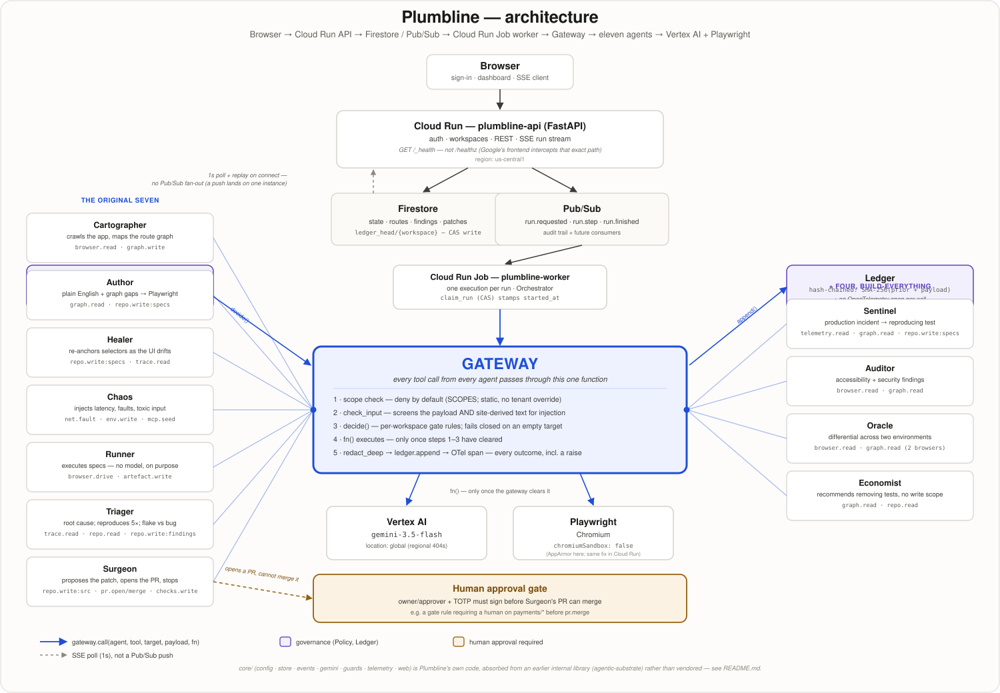

# Architecture



The one sentence version: **every tool call from every agent passes through a single
function.** Not most calls, not the risky ones — every one, from Cartographer reading a page
to Surgeon opening a pull request. That function is the Gateway (`gateway/gateway.py`), and
it is the reason the diagram above draws it as the biggest box on the page, sitting between
eleven agents and the two things they're allowed to touch: Vertex AI and a Chromium browser.

## The split: API vs worker

```
Browser ──► Cloud Run: plumbline-api (FastAPI)
              │  auth, workspaces, REST, SSE run stream
              ├──► Firestore          state, routes, findings, patches, the ledger
              ├──► Pub/Sub            run.requested, run.step, run.finished
              └──► Cloud Run Jobs     plumbline-worker (one execution per run)
                                        │
                                        ├── Gateway (scope, injection scan, gate rules, redact, ledger, trace)
                                        └── 11 agents ──► Vertex AI  gemini-3.5-flash (global)
                                                    └──► Playwright (Chromium, chromiumSandbox: false)
```

The API answers in milliseconds; a run takes minutes and drives a real browser. Cloud Run
Jobs gives the worker a full CPU and no request timeout, and the API service itself stays
scale-to-zero cheap because it never blocks on a run. The two halves communicate only
through Firestore and Pub/Sub — the worker never calls the API directly, and the API never
blocks waiting on the worker.

**Why the run stream doesn't fan out from Pub/Sub.** `GET /api/runs/{id}/stream` replays the
steps already recorded, then tails Firestore on a one-second poll. It deliberately does not
subscribe to the Pub/Sub topic and push to the connected client: a Pub/Sub push lands on
exactly one Cloud Run API instance, and the SSE client watching that run may be connected to
a different one. In-process fan-out would work perfectly on a laptop and silently drop steps
the moment the service scales past one instance — the kind of bug that only shows up in
production, under load, which is exactly when a customer is watching a run and would notice.
Pub/Sub still carries the run lifecycle events for the audit trail and for future consumers;
it just isn't what the browser listens to.

## The Gateway

`Gateway.call(workspace_id, agent, tool, target, payload, fn)` runs, in order, on every
single tool call in the product:

1. **Input safety.** `payload`, and any site-derived text (an accessible name, an element's
   own label) headed into the same model prompt, is scanned by `core.guards.check_input` for
   a prompt-injection or tool-poisoning attempt. The user is not the only attacker surface —
   the site under test is one too, which matters most for the agents that lean hardest on
   live content: Auditor, Oracle, Sentinel.
2. **A missing target on a gated tool is a blocked call, not an open one.** `target=""`
   cannot match a gate pattern, so an empty target for a tool that has a gate space fails
   *closed* rather than sailing through — checked independently in the Gateway and in
   `policy.decide()`, deliberately, so one layer's bug can't silently rely on the other.
3. **Authorisation.** `decide(agent, tool, target, rules)` returns allow, deny, or
   needs-human. Two kinds of policy feed it, and only one is tenant-configurable:
   - **Tool scopes** (`SCOPES` in `gateway/policy.py`) are static, in code. They describe
     what an agent *is* — no workspace setting can grant the Cartographer `pr.merge`.
   - **Gate rules** are per-workspace and versioned, because they're what an owner actually
     configures: which paths need a human, which environments Chaos may fault. Every ledger
     entry records the `policy_version` in force, so an audit trail can answer "which rules
     allowed this" — a static table can't.
4. **Execution.** Only once 1–3 have cleared does `fn()` — the agent's actual call to Vertex
   AI or Playwright — run at all.
5. **On the way out, always.** Every terminal branch — allowed, blocked, gated, or `fn()`
   raising an exception — redacts the result (`redact_deep`, walking dicts/lists/tuples, not
   just strings), appends one signed entry to the ledger, and emits an OpenTelemetry span.
   An authorised call whose execution fails still gets recorded; misreporting a genuine
   execution failure as a policy decision would corrupt what the audit record means, so the
   Gateway re-raises the original exception rather than a `GatewayError`.

Gate rules are what makes a blocked call a first-class product outcome instead of an error
screen: a workspace can require a human on `payments/*` before `pr.merge`, and the run detail
screen shows *why* the patch is waiting, not a stack trace.

## The ledger

`ledger` is append-only, chained by `signature = SHA256(prior_signature + payload)`, one
document per entry (not one growing array — Firestore's 1 MB document ceiling is roughly
5,000 array entries, weeks for a real workspace). A per-workspace `ledger_head/{workspace_id}`
document holds the current tip and is written **in the same transaction** as the new entry,
so two concurrent writers can't both read the same head, both compute the same next sequence
number, and fork the chain into two validly-signed entries at one seq. `Ledger.verify()` walks
the chain and recomputes every signature, so tampering — or a fork that slipped past the
transaction — is detectable, which is what "append-only" has to mean to be worth claiming.

## The eleven agents

The spec's original seven, plus four added under an explicit "build everything" directive
partway through the build. All eleven inherit the same `AgentContext` (repo, gateway, model,
one or more browsers) and the same four rules, learned the hard way across the batch reviews:
screen site-derived text through `check_input`, not only user input; wrap a whole loop in one
`gateway.call`, never call the gateway per item; normalise a URL like a browser would before
deciding it's internal (strip control characters, backslash-to-slash, then compare); and every
agent either runs and writes a real step, or explains in that step why it didn't — "silent"
and "nothing to do" must never look the same in the ledger.

| Agent | Job | Tool scope | Model |
|---|---|---|---|
| Cartographer | Crawl the app, maintain the route graph | `browser.read`, `graph.write` | gemini-3.5-flash |
| Author | Plain English + graph gaps → Playwright specs | `graph.read`, `repo.write:specs` | gemini-3.5-flash |
| Healer | Re-anchor selectors when the UI drifts, never touch an assertion | `repo.write:specs`, `trace.read` | gemini-3.5-flash |
| Chaos | Inject latency, faults, toxic input | `net.fault`, `env.write`, `mcp.seed` | gemini-3.5-flash |
| Runner | Execute specs, capture video/trace/HAR | `browser.drive`, `artefact.write` | **none** |
| Triager | Root cause, deterministic 5× repro, flake vs bug | `trace.read`, `repo.read`, `repo.write:findings` | gemini-3.5-flash |
| Surgeon | Propose the patch, open the PR, stop | `repo.write:src`, `pr.open`, `pr.merge`, `checks.write` | gemini-3.5-flash |
| Sentinel | Production incident → a reproducing test | `telemetry.read`, `graph.read`, `repo.write:specs` | gemini-3.5-flash |
| Auditor | Accessibility + security findings | `browser.read`, `graph.read` | gemini-3.5-flash |
| Oracle | Differential behaviour across two environments | `browser.read`, `graph.read` (two browsers) | gemini-3.5-flash |
| Economist | Recommends *removing* low-value tests | `graph.read`, `repo.read` — **no write scope at all** | gemini-3.5-flash |

Runner carries no model on purpose: test execution has to be deterministic, and a model in
that loop would make a failure unreproducible — which is the one property Triager's job
depends on. Economist holds no write scope of any kind: it's the only agent in the fleet that
can propose deleting something and cannot itself act on that proposal.

`Surgeon.pr.merge` is in its scope because the tool exists; the *gate rule* on a workspace's
`payments/*` path is what stops it from ever being exercised without a human. That's the
demo's strongest beat — see `DEMO_SCRIPT.md`.

## `core/` — absorbed, not vendored

`core/` (`config`, `store`, `events`, `gemini`, `guards`, `telemetry`, `web`) is Plumbline's
own code. It began as `agentic-substrate`, written earlier in this same hackathon to back our
other three submissions, and was folded into this repository rather than kept as a shared,
vendored dependency. Plumbline is one application, not three projects sharing a library, and
a vendored copy would have to be checked against a sibling directory that a clean clone of
*this* repository — and the Docker build context — simply does not have.
`tests/test_no_external_paths.py` enforces that directly: it fails if any source file in this
repository reaches back outside it. See `README.md`'s Provenance section for the full
disclosure this is here to satisfy.

## GCP facts this build has to respect

- **`gemini-3.5-flash` is served only on Vertex location `global`.** Every regional endpoint
  404s. `gemini-2.5-flash` runs regionally and would pass locally while silently failing the
  hackathon's model-version gate — the trap `core/config.py` is written to avoid.
- **`google-api-core` is pinned `>=2.34.0,<2.35.0`.** 2.35.0 percent-encodes Firestore's
  `(default)` database path into `%28default%29` and 400s every query.
- **`/healthz` is never the production health check.** Google's Cloud Run frontend
  intercepts that exact path before it reaches the container. `app/main.py` adds `/_health`
  alongside it — the path deploy scripts and uptime probes actually use, and the one that
  reports live model/location config rather than a hardcoded string.
- **Playwright needs `chromiumSandbox: false`**, in `agents/browser.py` and in
  `web/e2e/playwright.config.ts` alike: unprivileged user-namespace sandboxing needs a kernel
  setting AppArmor blocks locally, and Chromium can't launch inside a Cloud Run container
  without the same flag.
- Cloud Run, Firestore, Pub/Sub and Cloud Run Jobs all live in `us-central1`; Vertex model
  access is routed through `global` regardless.
